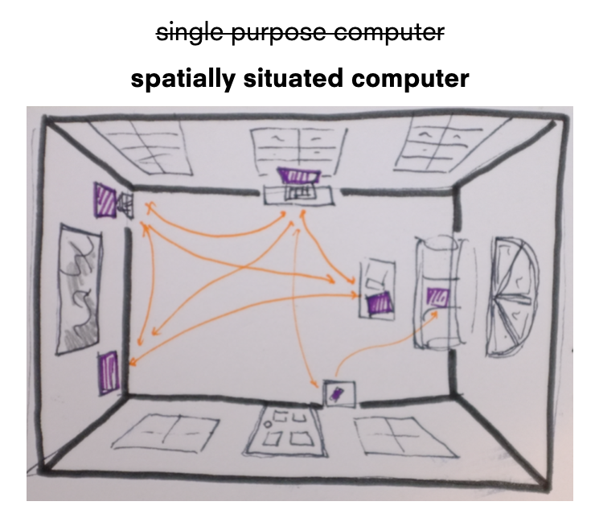

# spatialkeyboard

## Setup for dev

- npm install
- on macOS, iohook is broken - might need to rebuild via https://github.com/wilix-team/iohook/issues/124

currently via `keyboard-server.js` and `computer-client.js`

 
